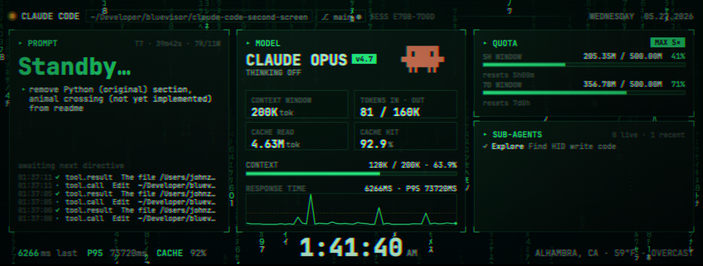

# claude-code-second-screen

Live agent telemetry on a USB second screen. Built for the
[**Thermalright Trofeo Vision LCD**](https://www.thermalright.com/product/trofeo-vision-lcd-black/)
(1280×480, USB-C, VID `0x0416` / PID `0x5302`).



Renders the current Claude Code or Codex session's status — what tool is running,
which model, context window fill, rolling 5-hour / 7-day token totals, log of
recent tool calls — directly onto a USB-attached LCD so you can glance at
your agent without alt-tabbing.

## Getting started

A native Swift/AppKit menu bar app in `macos/`. Renders at **30 fps** with a
pipelined architecture — the render queue and HID transfer queue run in
parallel, so frame throughput is limited by `max(pipeline, HID)` rather
than the sum. Open the Xcode project in `macos/` and build.

Auto-detects the newest active Claude Code or Codex session via
`SessionDiscovery`. Falls back to a clock-only display when no session
is active.

## Hardware

- **LCD**: Thermalright Trofeo Vision (or any [TRCC-compatible](https://github.com/Lexonight1/thermalright-trcc-linux) LCD). 1280×480 is the design target.
- **Host**: macOS (native app) or Linux (Python). Tested on Apple Silicon Macs and Raspberry Pi 5.

## Themes

| Theme | Description |
|---|---|
| **Matrix** *(default)* | Terminal CRT — three-panel grid with rain, scanlines, vignette |
| **Clock** | Fallback clock display when no active session |

### Matrix · terminal CRT

Three-panel grid:

- **Left** — Agent: status verb (`Thinking…` / `Reading…` / `Working…` …), wrapped prompt, tool detail, scrolling log
- **Middle** — Model: name, version, P50/P95 latency, in/out tokens, cache stats, context bar
- **Right** — Quota: 5H / 7D rolling token + cost windows, recent sub-agent invocations

Top rail: agent label, cwd / git-branch / session-id chips, weekday + date.
Footer: last-request / P95 / cache-hit stats, big wall-clock, timezone.

Visual effects: falling katakana glyph rain, CRT scanlines + vignette,
animated scan-highlight, blinking caret.

## Architecture (macOS native)

```
macos/Sources/NeoDashboard/
├── App/
│   ├── AppEnvironment.swift    # @MainActor shared state, config
│   └── FrameLoop.swift         # Render loop: timer → workQueue → hidQueue
├── Render/
│   ├── FrameRenderer.swift     # Renderer protocol + factory
│   ├── MatrixRenderer.swift    # Matrix theme (CGContext)
│   ├── ClockRenderer.swift     # Clock fallback
│   ├── AnimalCrossingRenderer.swift
│   ├── CRTPostProcessor.swift  # vImage pixel-shift scanlines
│   ├── RainPainter.swift       # Katakana rain columns
│   └── JPEGEncoder.swift       # ImageIO encode (q=0.25)
├── LCD/
│   ├── TrofeoVisionDriver.swift  # IOHIDManager hot-plug + frame send
│   ├── TRCCFraming.swift         # TRCC Type 2 wire protocol
│   └── LCDOutput.swift           # Protocol abstraction
├── Telemetry/
│   ├── ClaudeCodeSource.swift  # Tails ~/.claude jsonl files
│   ├── CodexSource.swift       # Tails ~/.codex jsonl files
│   ├── SessionDiscovery.swift  # Auto-switch newest session
│   └── WeatherService.swift    # CoreLocation + WeatherKit
└── UI/
    ├── MenuBarContent.swift    # Menu bar popover (status, preview, quit)
    ├── PreviewWindow.swift     # Floating LCD preview
    └── ConfigPanel.swift       # Settings
```

### Render pipeline

The frame loop runs two pipelined dispatch queues:

```
Timer (30 Hz)
  └─ workQueue ─── [Render 13ms] → [Orient 0.6ms] → [JPEG 1.2ms] ─┐
                                                                     │ async
  └─ hidQueue ──── [HID Send 20ms] ← ← ← ← ← ← ← ← ← ← ← ← ← ─┘
```

- **workQueue** renders the frame, applies CRT post-processing, rotates/flips
  for the LCD orientation, and JPEG-encodes. Pipeline time: **~15ms**.
- **hidQueue** sends the JPEG as ~86 × 512-byte HID output reports via
  `IOHIDDeviceSetReport`. Transfer time: **~20ms**.
- The queues overlap — effective frame interval is `max(15, 20) = 20ms`
  instead of `15 + 20 = 35ms`, comfortably hitting 30fps.
- A single-slot drop buffer discards stale frames if HID can't keep up.

See [`docs/pipeline.html`](docs/pipeline.html) for an interactive visualization
with adjustable timing sliders and a serial vs. pipelined comparison.

### Telemetry sources

**Claude Code** (`ClaudeCodeSource`): scans `~/.claude/projects/**/*.jsonl`,
bootstraps 7-day token history on startup, then tails the active session at
4 Hz. Derives status from the most recent meaningful event (tool use → tool
verb, thinking → thinking, text → writing, else idle).

**Codex** (`CodexSource`): tails `~/.codex/sessions/**/*.jsonl`, reads
session metadata for model/cwd, derives status from function calls and
reasoning events.

### Performance

| Metric | Before (May 26) | After (May 27) |
|---|---|---|
| Total frame time | 87ms | **15ms** pipeline / 20ms HID |
| Effective FPS | ~6 | **30** sustained |
| JPEG size | 248KB (q=0.85) | 44KB (q=0.25) |
| Memory | 360MB+ growing | 179MB stable |
| Skipped frames | 190/10s | 0 |
| HID drops | — | 0 |

Key optimizations: vImage CRT (replaced CIFilter), CTLine text cache,
gradient/scanline baking, CGContext reuse, async telemetry, pipelined
HID queue.

## Limitations

- **macOS only.**
- **No live rate-limit data.** The dashboard computes rolling token totals
  from the jsonl rather than reading API rate-limit headers.
- **Single active session.** Always shows the most-recently-modified jsonl.
- **Latency is a proxy** from inter-event timestamps, not wall-clock API latency.

## Credits

- **[thermalright-trcc-linux](https://github.com/Lexonight1/thermalright-trcc-linux)**
  by Lexonight1 — the reverse-engineered HID protocol.
- **[JetBrains Mono](https://www.jetbrains.com/lp/mono/)** — bundled under
  the SIL Open Font License 1.1.

## License

[MIT](LICENSE).
