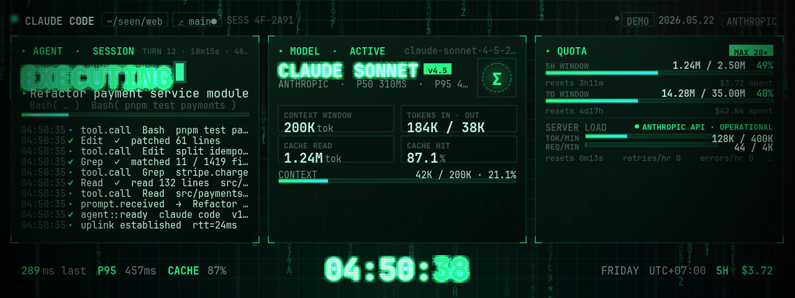

# claude-code-second-screen

Live agent telemetry on a USB second screen. Built for the
[**Thermalright Trofeo Vision LCD**](https://www.thermalright.com/product/trofeo-vision-lcd-black/)
(1280×480, USB-C, VID `0x0416` / PID `0x5302`), running on a Raspberry Pi.


Renders the current Claude Code session's status — what tool is running,
which model, context window fill, rolling 5-hour / 7-day token totals, log of
recent tool calls — directly onto a USB-attached LCD so you can glance at
your agent without alt-tabbing.

The dashboard ships in two modes:

| Mode | Data source | Use it for |
|---|---|---|
| `--source claude-code` *(default)* | `~/.claude/projects/**/*.jsonl` | Your actual Claude Code session |
| `--source demo` | Built-in state-machine simulator | Showroom / no Claude installed |

## Hardware

- **LCD**: Thermalright Trofeo Vision (or any other [TRCC-supported](https://github.com/Lexonight1/thermalright-trcc-linux) LCD — protocol is auto-detected). 1280×480 is the design target; other resolutions will letterbox or scale.
- **Host**: any Linux box with USB and Python 3.11+. Tested on a Raspberry Pi 5 / arm64.

The LCD handshake and frame-push are handled by the excellent
[`thermalright-trcc-linux`](https://github.com/Lexonight1/thermalright-trcc-linux)
project — see *Credits* below.

## Quick start

```bash
# 1. Get TRCC's HID driver + udev rules
sudo apt install pipx libusb-1.0-0 sg3-utils
pipx install trcc-linux
trcc setup -y                # installs udev rules (one sudo prompt)
# unplug/replug the LCD's USB-C cable so the rules take effect

# 2. Get this project (JetBrains Mono TTFs are bundled under OFL 1.1)
git clone https://github.com/bluevisor/claude-code-second-screen.git
cd claude-code-second-screen
python3 -m venv .venv
.venv/bin/pip install PySide6 pyusb

# 3. Run
QT_QPA_PLATFORM=offscreen .venv/bin/python -m agent_dashboard
```

The first frame should appear on the LCD within ~2 seconds.

## CLI flags

```
--source {claude-code,demo}    telemetry source (default: claude-code; falls back to demo)
--mirror                       also show a window on the desktop (useful for dev)
--no-lcd                       don't push to LCD (window only)
--fps N                        render+push framerate (default 15)
--sim-ms N                     demo state-machine tick interval (default 380)
--quality N                    JPEG quality 1-100 (default 85)
```

## Themes

The handoff bundle described four themes (`matrix`, `fantasy`, `cozy`, `studio`)
but only **matrix** is implemented today.

### Matrix · terminal CRT

The default look. Three-panel grid:

- **Left** — Agent: status verb, current task, tool detail, progress bar, scrolling log
- **Middle** — Model: name, version, latency, context bar, in/out + cache totals
- **Right** — Quota: 5H / 7D rolling windows, server status, tok/min and req/min

Visual effects: phosphor glow on big text, falling katakana glyph rain,
radial-masked hairline grid, animated scan-highlight on the activity bar,
pulsing LIVE indicator, CRT scanlines + vignette.



## Architecture

```
agent_dashboard/
├── __main__.py          # CLI
├── app.py               # QApplication + render loop (renders → JPEG → LCD)
├── fonts.py             # Loads bundled JetBrains Mono into Qt's font DB
├── lcd/
│   └── output.py        # Wraps TRCC's HidDeviceType2 + PyUsbTransport
├── telemetry/
│   ├── types.py         # AgentTelemetry dataclasses
│   ├── demo.py          # State-machine simulator (port of useTelemetryDemo)
│   └── claude_code.py   # Tails ~/.claude/projects/**/*.jsonl
└── themes/
    ├── matrix.py        # Matrix theme widget (QPainter)
    └── matrix_fx.py     # Rain painter, masked grid, glow-text helper
```

The render loop is a `QTimer` ticking at `--fps`: it calls `widget.render(QImage)`
to capture an offscreen 1280×480 image, encodes JPEG, and hands it to
`HidDeviceType2.send_frame()` which the LCD JPEG-detects via the `FF D8`
magic bytes. The whole loop is <10 ms per frame on a Pi 5.

For Claude Code mode, `ClaudeCodeSource`:

1. On startup, scans every `*.jsonl` under `~/.claude/projects/` mtime'd
   within the last 7 days, accumulating per-event token totals into a deque.
2. On each tick (1 Hz), it `seek()`s past the previously-read offset of the
   active session file and parses only the new lines.
3. Derives `agent.status` from the last event: open `tool_use` → `tool`;
   recent assistant `text` → `writing`; trailing `thinking` block → `thinking`;
   else `idle`.
4. Sums every assistant message's `usage` into cumulative + rolling windows.

## Limitations

- **Matrix is the only theme.** Fantasy / Cozy / Studio (from the handoff
  bundle) aren't ported.
- **`server.tokensRemainingMin` is 0.** Claude Code's jsonl doesn't carry
  the API rate-limit response headers, so the "TOK/MIN" and "REQ/MIN" rows
  are placeholders. (A future MITM proxy could fill these in.)
- **Quota caps are auto-scaled** from observed usage rather than your
  actual plan limits. Adjust `cap_5h` / `cap_7d` in
  `telemetry/claude_code.py` if you want hard targets.
- **Latency is a proxy** computed from inter-event timestamps in the
  jsonl, which includes human idle time. Don't read p95 as wall-clock API
  latency.
- **Single active session.** The dashboard always shows the
  most-recently-modified jsonl. If you run multiple Claude Code sessions in
  parallel, the focus switches whenever one writes a new event.

## Credits

- **[thermalright-trcc-linux](https://github.com/Lexonight1/thermalright-trcc-linux)**
  by Lexonight1 — the reverse-engineered HID protocol that makes this LCD
  controllable from Linux at all. Massive thanks; without it this project
  doesn't exist.
- **[claude.ai/design](https://claude.ai/design)** — the dashboard's visual
  design started as a Claude Design handoff bundle, recreated in native Qt.
- **[JetBrains Mono](https://www.jetbrains.com/lp/mono/)** — bundled under
  the SIL Open Font License 1.1.

## License

[MIT](LICENSE).
